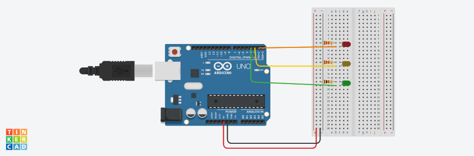

# traffic-lights
code without delay

## Arduino



## Code

```C++
#define RED 1
#define YELLOW 2
#define GREEN 3

int state = 1;

unsigned long t0 = 0;

void setup()
{
  pinMode(RED, OUTPUT);
  pinMode(YELLOW, OUTPUT);
  pinMode(GREEN, OUTPUT);
}
void loop()
{
  unsigned long t1= millis();
  switch (state) {
    case 1:
   		digitalWrite(GREEN, LOW);
    	digitalWrite(YELLOW, LOW);
    	digitalWrite(RED, HIGH);
    	if (t1 - t0 > 3000){
    		state = 2;
      		t0 = t1;
    	}
    	break;
   
    case 2:
        digitalWrite(RED, LOW);
    	digitalWrite(GREEN, LOW);
    	digitalWrite(YELLOW, HIGH);
        if (t1 - t0 > 1000){
    		state = 3;
      		t0 = t1;
    	}
    	break;
   
    case 3:
        digitalWrite(RED, LOW);
    	digitalWrite(YELLOW, LOW);
   	 	digitalWrite(GREEN, HIGH);
        if (t1 - t0 > 3000){
    		state = 4;
      		t0 = t1;
    	}
    	break;
    
     case 4:
        digitalWrite(RED, LOW);
    	digitalWrite(GREEN, LOW);
    	digitalWrite(YELLOW, HIGH);
        if (t1 - t0 > 1000){
    		state = 1;
      		t0 = t1;
    	}
    	break;
  }  
}
```
